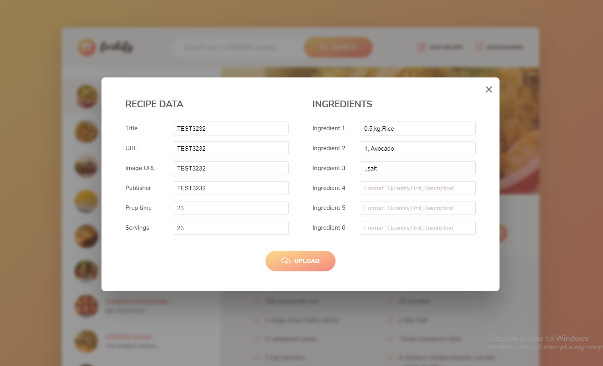

# Forkify
<h3>This is front-end website where someone can search and add recipes.</h3>
Done as part of the Udemy course called "The Complete JavaScript Course 2022: From Zero to Expert!" by Jonas Schmedtmann<br><br>





# Tools and services used
<ul>
<li><b>Parcel</b></li>
<li><b>MVC Pattern</b></li>
<li><b>Forkify API</b> for the cooking data. <a href="https://forkify-api.herokuapp.com"> API info<a></li>
</ul>

# Local Installation
```
git clone https://github.com/ics20072/Forkify.git or download the zip from github and extract it
Import Forkify folder to vscode
Confirm you are on "Forkify" directory
npm install
npm run start || npm run dev
Follow the server link that provided after build
```

# Live: 
https://minas-forkify.netlify.app
