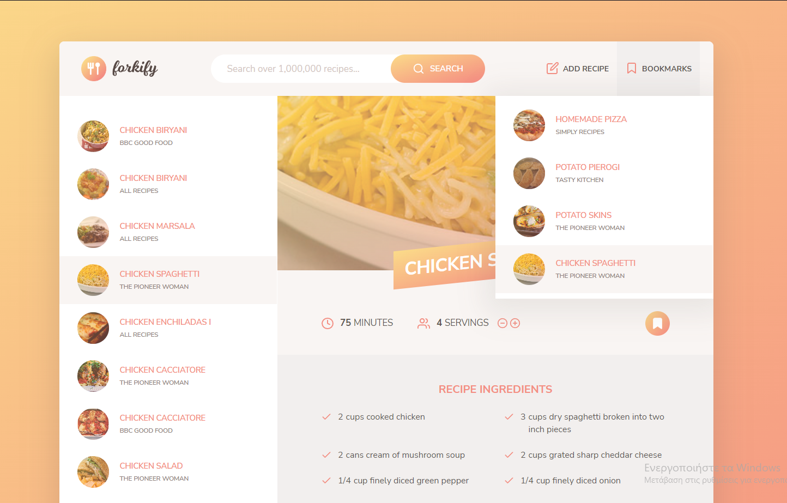

# Forkify
<h3>This is front-end website where someone can search and add recipes.</h3>
Done as part of the Udemy course called "The Complete JavaScript Course 2022: From Zero to Expert!" by Jonas Schmedtmann  

# Tools and services used
# Local Installation

# Live: 
https://minas-forkify.netlify.app
